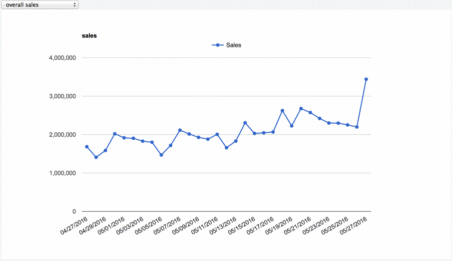

# TypeScript Interview Exercise

To run: 
```
npm install
npm start
npm build
```

Website runs at `http://localhost:7000`

## Goal
The goal of this test is to take JSON from a reporting API and render it in a Google Line Chart. The JSON will have 4 metrics (sales, page views, click through rate and orders) that should be displayed in the chart, one line at a time. There should be a way to switch from displaying one metric to another.
You won't be querying an actual API, the JSON is provided.

## Requirements:
* Use the react.js library.
	For Backbone: Use a model to store the data and use a view to display the graph.
	For Vue: Use a Vuex Store to store the data
* Use Google Line Chart to display the data. See https://developers.google.com/chart/interactive/docs/gallery/linechart on how to use it.
* The end result should only have one line/metric at a time, but the user should be able to switch from one line to the other with a select. The date will be on the x-axis, the other metrics will be on the y-axis
* Zip up any js, html and css you have, or use something like jsfiddle.net, plnkr.co to put it online. Feel free to use CDN's for any libraries you used.

* See the example.gif for how the result could look like
instructions.txt
* Displaying instructions.txt.



## Codebase Overview
* The codebase here is potentially something that a junior / less experienced developer may have worked on. 
* Refactoring is welcome - we will talk through any refactoring that you have made as part of reviewing the solution to the exercise.


